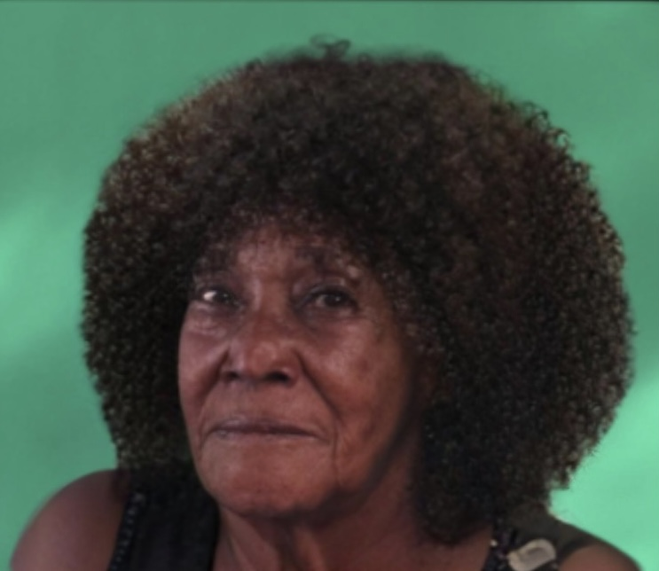

+++
title = "Ist man wirklich alleine in einem fremden Land?"
date = "2023-05-05"
draft = false
pinned = false
tags = ["Migration"]
image = "unknown.jpeg"
+++
 Benet Belay (47) aus Äthiopien ist vor 10 Jahren ohne ihre Familie in die Schweiz immigriert. Mit der Familie in Äthiopien ist der Kontakt abgebrochen. Ich beabsichtige, mit Benet über ihre Emotionen, ihre Erfahrungen im Zusammenhang mit der Einwanderung und die Folgen, die diese auf ihr Leben haben, zu sprechen.




Immigration bezieht sich auf die dauerhafte oder vorübergehende Bewegung von Menschen aus einem Land in ein anderes, um dort zu leben und zu arbeiten. Es kann viele Gründe für die Einwanderung geben, einschließlich der Suche nach besseren wirtschaftlichen oder sozialen Bedingungen. Ein Beispiel für Migration ist, wenn jemand aus einem ländlichen Gebiet in eine Stadt zieht, um Arbeit zu finden. Ein anderes Beispiel ist, wenn jemand aus einem anderen Land in die Schweiz zieht, um hier zu studieren oder zu arbeiten. Im Jahr 2021 hatten 2 890 000 Personen bzw. 39% der ständigen Wohnbevölkerung ab 15 Jahren einen Migrationshintergrund. Etwas mehr als ein Drittel dieser Bevölkerungsgruppe (1 090 000 Personen) besass die Schweizer Staatsangehörigkeit. Mehr als vier Fünftel der Personen mit Migrationshintergrund (2 276 000 Personen) gehören zur ersten Generation, während ein Fünftel (615 000 Personen) in der Schweiz geboren wurde. Mehrs als drei Viertel der ständigen Wohnbevölkerung unter 15 Jahren besitzen die Schweizer Staatsangehörigkeit und sind in der Schweiz geboren. Das verbleibende Viertel ist entweder im Ausland (10%: 8% ausländische und 2% schweizerische Staatsangehörige) bzw. in der Schweiz geboren und im Besitz eines ausländischen Passes (19%).



Wir steigen in Bümpliz aus und gehen weiter, bis wir das Café vor uns sehen. Langsam und unsicher betreten wir das Café Tscharni und spüren die warme einladende Atmosphäre. Gespräche im Hintergrund dringen an unsere Ohren. Normalerweise ist es nicht üblich, dass es in diesem Restaurant eine Menge von Menschen hat, die von der Immigration betroffen sind, jedoch ist es heute anders. Eine Gruppe von Immigranten trifft sich heute in dem Café Tscharni und wir haben die Gelegenheit dabei zu sein. Vor dem Gespräch mit Benet Belay bekommen wir erst einmal einen Einblick in den Kurs, der hier wöchentlich im Café stattfindet. In dem Raum sind Frauen, die alle ähnliche Erfahrungen machen. Sie tauschen sich zuerst gegenseitig über ihr Wochenende aus, steigen danach aber direkt in den eigentlichen Kurs ein. In diesem sind pro Gruppe etwa 10 Frauen. Die Kursleiterin Vera stellt ihnen Aufgaben, die sie gemeinsam auf Deutsch lösen müssen. 

## Wir kommen mit Benet ins Gespräch

Wir suchen uns nun inmitten der Geräuschkulisse von Gesprächen und schepperndem Geschirr mit Benet einen Platz. Sie sieht gespannt aus, wirkt aber auch etwas unsicher. Als ich das Gespräch mit unserer ersten Frage beginne, bemerken ich, dass Benet mich hilflos ansieht. Sie fängt an zu seufzen. Die Schweiz gehört zu den Ländern mit dem höchsten Anteil an ausländischen Personen im Land. Es heisst, dass der Anteil der ausländischen Wohnbevölkerung in der Schweiz besonders hoch ist (25%). Dies liegt aber auch daran, dass das Land sehr strenge Einbürgerungs-Richtlinien hat.  Die Schweizer Staatsbürgerschaft wird nur an Personen vergeben, die sich gut in die Schweiz integrieren und über einen langen Zeitraum dort wohnhaft sind. Aus diesem Grund entscheiden sich viele Ausländerinnen und Ausländer dafür, ihre ursprüngliche Staatsbürgerschaft beizubehalten. Dies ist auch bei Benet der Fall: *«Es ist sehr schwierig in der Schweiz ohne Papiere»*,  sagt sie. Die sogenannten Immigranten besuchen meist viele verschiedene Kurse. Auch Benet besucht sie. Sobald ich das Thema “Heimatland” anspreche, unterbricht sie unser Gespräch und weigert sich, darüber zu sprechen. *«Es ist Vergangenheit»* sagt sie, während ihr Tränen in die Augen treten. Ich merke, dass Benet, obwohl sie Äthiopien vor 10 Jahren verlassen hat, immer noch Schwierigkeiten hat, das Geschehene zu verarbeiten und einzuordnen.

## Ihre Reise in die Schweiz

Als Nächstes berichtet mir Benet von ihrer Reise in die Schweiz. "Ich hatte viele Schwierigkeiten auf meinem Flug in die Schweiz", sagt sie und erläutert die genauen Gründe, weshalb es als Immigrantin in erster Linie schwierig ist. Da Benet im dieser Zeit lange keine Einkommensquelle hat, hat sie auch keine Möglichkeit, eine Unterkunft zu finden. Sie hatte viele verschiedene Jobs, unter anderem auch im Restaurant als Kellnerin. Nachdem das Restaurant geschlossen wurde, fand sie wieder einen neuen Job. Ihr neuer Chef half ihr, indem er ihr Kleidung zur Verfügung stellte und ihr ein guten Lohn gab, so dass sie endlich ein Zuhause hatte. Nun erscheint ein verzaubertes Lächeln auf ihrem Gesicht, was auch bei uns ein Lächeln auslöst. 

## «Es ist nicht einfach ohne Familie»

Durch ihre Erfahrungen im Service hat sie sich auch mit der Freiwilligenarbeiten auseinandergesetzt. *«Ich kam durch die Polizei darauf. Eine Schweizer Polizistin hat mir gesagt, ich muss irgendwo anfangen»,* erklärt sie. Sie ist nicht allein, aber einsam. Sie liess ihre Familie zurück, aber hier in der Schweiz hat sie auch keine. Der Grund, weshalb sie keine eigene Familie gegründet hat, ist einerseits die finanziellen, anderseits auch ihre gesundheitlichen Probleme und Beschränkungen. *«Ich habe mir überlegt, eine Befruchtung zu machen, jedoch reicht mir das Geld nicht»*, begründet sie Ihre Entscheidung. Ihre Beziehungen zu Männern scheitern jedes Mal, nachdem sie erfahren, dass Benet keine Kinder kriegen kann. Benet beschäftigt das Thema mental sehr. *«Nun bin ich zu alt dafür»*, resümiert sie und wirft uns einen traurigen Blick zu. 

*«Ich habe sehr viele Freunde»*, betont sie überzeugt. Ihre Freunde sind vor allem Schweizer, welche sie durch Kurse und durch ihre immer abwechselnde Arbeit kennen gelernt hat. Sie bekommt sehr viel Hilfe von den SchweizerInnen, aber erlebt durch sie auch den grössten Hass. *«Rassismus ist in diesem Land sehr massiv»*, meint sie und erzählt uns von ihren Erfahrungen, was uns sehr traurig macht und auch schockiert. *«Das Leben ist nicht einfach»*. Es ist schwierig ein Leben für sich in einem ganz fremden Land aufzubauen, wenn man nicht einmal die Sprache spricht. Obwohl die Schweiz ein sehr gutes und priviligiertes Land ist, werden manche Leute immer noch diskriminiert und ausgeschlossen, nur weil sie nicht Schweizer sind.